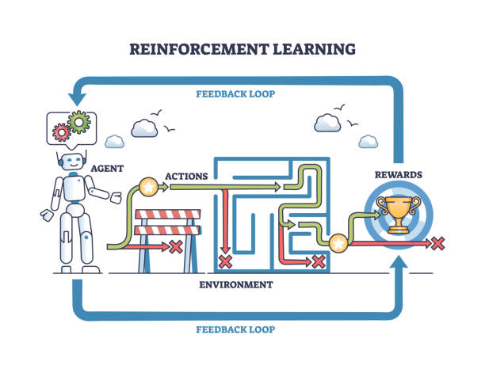
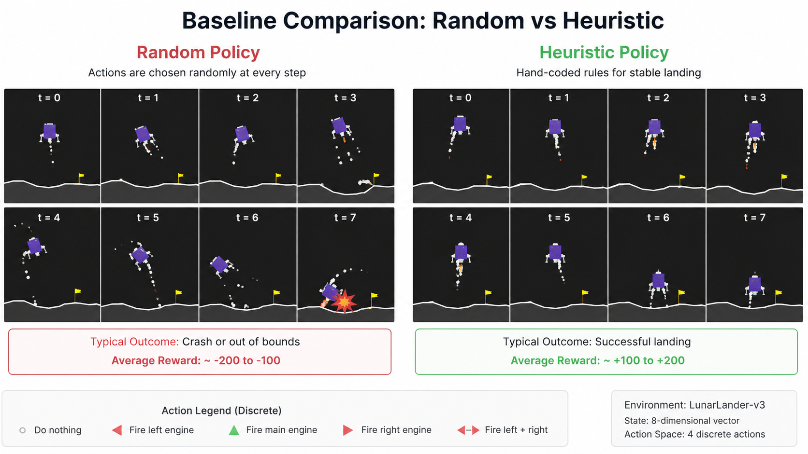
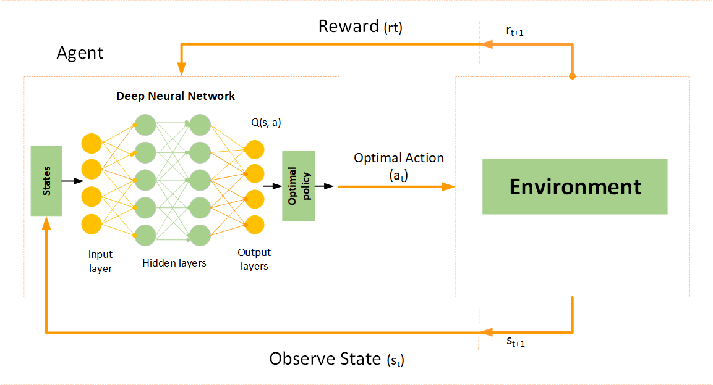
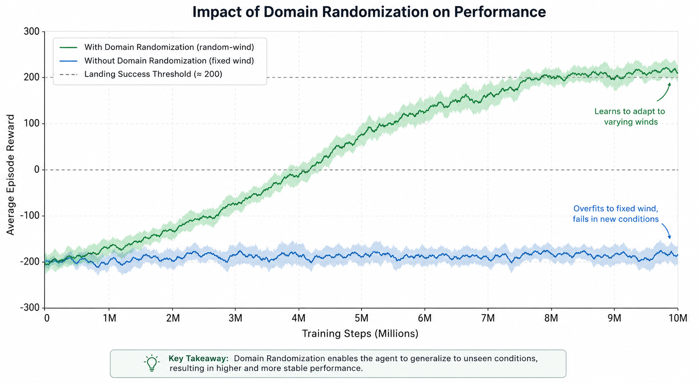
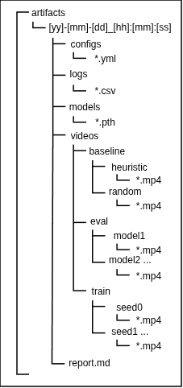

# StartTrek Final Report: Autonomous Lunar Landing via Custom Deep Q-Network

> **Project:** StartTrek - Reinforcement Learning  
> **Context:** Autonomous Lunar Landing in Gymnasium `LunarLander-v3`  
> **Language:** Python  
> **Libraries:** Gymnasium, PyTorch  
> **Authors:** Aberkane Mathys, Combe-Bracciale Nielsen, Vincent Julie  
> **Date:** 17/05/2026

---

## Executive Summary

This project aims to train an autonomous spacecraft capable of landing safely on the Moon using reinforcement learning (RL), a branch of machine learning where an agent learns by trial and error.

Unlike supervised learning (where a model learns from labeled examples), reinforcement learning learns from **interaction**:

- observe the environment,
- take an action,
- receive a reward or penalty,
- improve future decisions.

Our objective was to solve the Gymnasium `LunarLander-v3` environment and achieve a **mean score ≥ 200 over 100 consecutive episodes**, while maintaining full reproducibility, robust engineering practices, and explainable methodology.

Starting from an early prototype, we progressively designed a **custom Deep Q-Network (DQN)** implementation using PyTorch, replacing all external RL frameworks to fully control the learning pipeline.

The final result is a robust, reproducible RL framework capable of generalized autonomous landings, including under randomized wind conditions.

---

## 1. Problem Definition

### 1.1 Mission Context

In the StartTrek scenario, humanity wants to build a relay station on the Moon before launching human missions to Mars.

Before sending humans, we must ensure our lunar module can land **autonomously**.

That means building an AI pilot.

---

### 1.2 The Environment

We use the Gymnasium environment `LunarLander-v3`.

Gymnasium provides a physics simulator of a 2D lunar module, including gravity, collisions, fuel consumption, and realistic thruster dynamics. This allows us to focus entirely on the reinforcement learning problem rather than building a simulator from scratch.

PyTorch is used to design and train our neural network. It provides efficient tensor computation, automatic differentiation for backpropagation, and optional GPU acceleration to significantly speed up training.

#### Actions (Discrete)

The agent can choose among 4 actions:

1. Do nothing
2. Fire left thruster
3. Fire main engine
4. Fire right thruster

---

#### State Space

The state is an 8-dimensional vector:

- x position
- y position
- horizontal velocity
- vertical velocity
- angle
- angular velocity
- left leg contact
- right leg contact

---

#### Reward Function

The reward encourages:

- staying near landing pad  
- slow descent  
- stable orientation  
- landing on both legs  

Penalties:

- fuel usage  
- crashing (~ -100)  

Bonus:

- safe landing (~ +100)

---

---

## 2. Reinforcement Learning Concepts

### 2.1 What is Reinforcement Learning ?

Reinforcement learning is similar to teaching a child to ride a bicycle:

- try,
- fail,
- receive feedback,
- improve.

The agent learns a **policy**: “what action should I choose in this situation ?”

---

### 2.2 Markov Decision Process (MDP)

Our problem is modeled as an **MDP (Markov Decision Process)**.

An MDP is defined by:

- **State (S):** where am I ?
- **Action (A):** what can I do ?
- **Reward (R):** was that good or bad ?
- **Transition (P):** what happens next ?
- **Discount (γ):** how much do I care about future rewards ?

This forms the classic RL loop:

State → Action → Reward → Next State

---

---

### 2.3 Exploration vs Exploitation

The agent must balance:

- **Exploration:** try new things.
- **Exploitation:** use what already works.

We use **epsilon-greedy**:

- with probability ε → random action
- otherwise → best known action

At the start: high ε  
At the end: low ε

---

### 2.4 Value Function and Q-learning

The Q-value answers:  
“How good is action A in state S ?”

Mathematically:  
Q(s,a)

Our neural network approximates this value.

---

## 3. Baselines

Before training AI, we implemented simpler reference policies.

### 3.1 Random Policy

Completely random actions.

Purpose:

- lower bound performance.

Expected score: very poor.

---

### 3.2 Heuristic Policy

Hand-coded rules:

- if tilted left → fire left thruster
- if tilted right → fire right thruster
- if falling too fast → fire main engine

Purpose:

- human-designed baseline.

---

---

## 4. Our Custom DQN Architecture

### 4.1 Why not Stable-Baselines3?

Early prototype used Stable-Baselines3.

We removed it because project constraints required understanding and implementing RL ourselves.

Advantages:

- full control
- better debugging
- better learning
- reproducibility

---

### 4.2 Neural Network

Architecture:

Input: 8  
Hidden: 256 ReLU*  
Hidden: 256 ReLU  
Output: 4 Q-values

**ReLU is the activation function used between hidden layers. It keeps positive information and removes negative values, allowing the neural network to learn complex non-linear relationships such as how position, speed, angle, and wind interact during landing.  
Without ReLU, our network would behave almost like a simple linear calculator and would struggle to learn such complex behaviors.*

---

  

---

### 4.3 Replay Buffer

Stores past experiences:  
(state, action, reward, next_state, done)

Why?

Because learning on consecutive frames is unstable: consecutive observations are highly correlated (for example, several frames during a fall look almost identical), which can make training noisy and inefficient.

Instead of learning only from what just happened, the Replay Buffer stores many past experiences and randomly samples mini-batches from this memory. This acts like a “memory bank,” allowing the agent to revisit older situations in a different order.

This random sampling breaks temporal correlations, improves sample efficiency, and significantly stabilizes learning.

Instead of: [s101, s102, s103, s104]  
The model learns with:  [s15, s104, s42, s87]

---

### 4.4 Target Network

A second neural network, called the target network, is used to stabilize training.

In standard Q-learning, the model updates its predictions using target values computed from its own current predictions. This creates a moving target problem: the network is trying to chase values that are constantly changing, which can lead to instability and oscillations.

To solve this, DQN uses two networks:

- the policy network, which is updated at every learning step
- the target network, which is a frozen copy of the policy network and is updated only periodically

This means the target values remain temporarily fixed while the policy network learns, making the data and calculations much more stable.

Without a target network, training can diverge or oscillate. With it, convergence is smoother and more reliable.

---

### 4.5 Epsilon Decay Improvement

Early prototypes decayed the exploration rate ($\epsilon$) at the end of each **episode**. Because untrained agents crash rapidly, early episodes lasted only a few frames, causing $\epsilon$ to drop before the agent could gather meaningful experiences.

To fix this, we implemented a **per-step** decay.  
This ensures exploration scales with actual environmental interaction rather than the number of quick failures, significantly stabilizing the learning curve.

---

## 5. Training Optimizations

### 5.1 GPU Acceleration

Processing dense matrix multiplications for mini-batches on a CPU was our primary bottleneck. We integrated native **CUDA support** via PyTorch to offload tensor computations to the GPU.

To prevent runtime device mismatch errors, we synchronized our memory pipeline:

- **Networks:** Both `policy_net` and `target_net` are moved to the GPU at initialization via `.to(device)`.

- **States:** Environmental observations returned as NumPy arrays are converted to PyTorch tensors and explicitly pushed to the active device before inference or backpropagation.

This parallelization dramatically accelerated our gradient descent steps.

---

### 5.2 Disable Rendering During Training

Synchronous GUI rendering (`render_mode="human"`) heavily throttles the training loop due to frame-rate capping and system window overhead. We decoupled learning from visualization:

- **Training:** Configured with `render_mode=None` and `video_freq=0` to focus purely on numerical physics.

- **Evaluation:** Isolated the `RecordVideo` wrapper to run exclusively during periodic checkpoints (e.g., every 50 episodes).

Eliminating visual overhead yielded an approximate **10x speedup**, letting the agent process hundreds of steps per second.

---

### 5.3 Best Model Saving

Saving model weights at fixed intervals (e.g., every 100 episodes) risks preserving a degraded policy, as RL agents often experience temporary performance dips due to gradient noise or exploration spikes.

We implemented a **performance-driven checkpoint strategy**:

- Track the highest historical evaluation score in a persistent `best_mean_reward` variable.

- During evaluation phases (mean score over 100 consecutive episodes), if the current agent outperforms the record, the weights are immediately saved as `best_model_seed_X.pth`.

This guarantees that we always export the most stable, high-performing pilot without wasting storage space on redundant intermediate checkpoints.

---

## 6. Robustness via Domain Randomization

Training an agent in a static environment risks overfitting to specific environmental forces.  
Early iterations learned to fight a constant lateral push, causing the lander to crash immediately when evaluated under zero-wind conditions.

To enforce true policy generalization, we implemented **Domain Randomization** via the `--random-wind` flag.  
At the start of each episode, the environment dynamically toggles wind presence and randomizes its power between `5.0` and `20.0`.  
This forces the neural network to **adapt to real-time** state changes (velocities and angles) rather than memorizing a fixed external force.

---

  

---

## 7. Experimental Protocol

### 7.1 Hyperparameter Ablation

We conducted a systematic ablation study to isolate the impact of optimization hyperparameters on policy convergence. Testing revealed that a lower learning rate (`learning_rate = 0.0001`) paired with a smaller batch size (`batch_size = 64`) yielded the most stable policies.

The smaller batch size introduces beneficial gradient noise, acting as a regularizer that helps the agent escape early local optima (such as hovering indefinitely), while the conservative learning rate prevents policy divergence.

Tested:

- `learning_rate = 0.001` vs `0.0001`
- `batch = 64` vs `128`

Best:

- `learning_rate = 0.0001`
- `batch_size = 64`

---

| Run ID | Learning Rate ($\alpha$) | Batch Size | Max Episodes | Domain Randomization | Mean Eval Score (100 Ep) $\pm$ 95% CI | Status / Engineering Outcome |
| :--- | :--- | :--- | :--- | :--- | :--- | :--- |
| **#1 (Optimal)** | **$0.0001$** | **$64$** | **$1500$** | **Enabled (Variable Wind)** | **$+242.5 \pm 12.4$** | **PASSED** (Target Criteria Met) |
| #2 | $0.001$ | $64$ | $1500$ | Enabled (Variable Wind) | $-45.2 \pm 38.1$ | **FAILED** (High gradient variance; diverged) |
| #3 | $0.0001$ | $128$ | $1500$ | Enabled (Variable Wind) | $+145.8 \pm 22.3$ | **FAILED** (Stuck in local optima due to smooth gradients) |
| #4 | $0.0001$ | $64$ | $1000$ | Enabled (Variable Wind) | $+188.2 \pm 15.6$ | **FAILED** (Incomplete asymptotic convergence) |
| #5 | $0.0001$ | $64$ | $1500$ | Disabled (Static Wind) | $-112.4 \pm 45.8$ | **FAILED** (Severe overfitting to wind profile) |

---

### 7.2 Reproducibility

Deep RL is notoriously sensitive to initialization variance. To guarantee strict scientific reproducibility, we established a multi-seed protocol utilizing five canonical seeds (`0, 1, 2, 3, 4`).

At runtime, random number generators are explicitly locked across all layers: Python's native `random` module, `NumPy`, `PyTorch` (CPU/CUDA device alignments), and the `Gymnasium` environment space.  
The entire execution lifecycle is fully automated via a single shell script: `reproduce.sh`.

---

### 7.3 Confidence Interval

Evaluating an agent on a single training run is statistically invalid due to environmental stochasticity. To combat this, we aggregate performance metrics across all 5 canonical seeds.

To prevent sequential plotting distortions(where standard charting tools incorrectly connect successive seed timelines linearly) our automated evaluation pipeline utilizes a `pandas.groupby("Episode")` aggregation strategy. This maps all parallel runs onto a unified, synchronized timeline.

We report the sample mean alongside a **95% Confidence Interval (95% CI)** calculated via Student's t-distribution:

$$\text{CI} = \bar{X} \pm t_{\alpha/2, n-1} \left( \frac{s}{\sqrt{n}} \right)$$

In our automated graphics suite, this statistical distribution is rendered as a clean, continuous mean trajectory bounded by a translucent shaded area representing the 95% CI. This eliminates raw visual noise and provides mathematical proof of the algorithm's long-term stability.

---

## 8. Tracking and Engineering Quality

To maintain production-grade software standards, we decoupled the training pipeline from monitoring and built a dedicated verification architecture:

- **Deep Telemetry Logging:** We refactored the optimization step within `agent.py` to extract individual optimization costs via `loss.item()`. The training loop averages these values per episode and appends them to a dedicated `Loss` column in our centralized telemetric ledger (`logs.csv`).

- **Centralized Artifacts (`artifacts.py`):** Automatically generates timestamped directories for every run, cleanly separating evaluation metrics (`logs.csv`), serialized PyYAML configurations, `.pth` model checkpoints, and rendered videos.

- **Dual-Mode Visualization Pipeline (`plot.py`):** Integrated a one-click automated chart generator triggered immediately at the end of the execution cycle. It operates in two dynamic display modes:

  - *Single-Seed Mode:* Visualizes raw episode performance overlaid with a 20-episode moving average trendline to smooth out high-frequency reward fluctuations.
  - *Multi-Seed Mode:* Automatically groups multi-run matrices to plot global statistical averages alongside their respective 95% CI shaded bands and categorical termination cause distributions (Crash vs. Out-of-view vs. Sleep).

- **Automated Smoke Testing:** A `pytest` suite executes a fast, 3-episode cycle to validate the replay buffer integrity, tensor device configurations, and logging paths in under seven seconds, catching silent bugs before heavy training blocks begin.

- **Code Coverage:** Integrated `pytest-cov` to map execution pathways, maintaining a robust **84%** test coverage baseline across the entire codebase.

---

  
Edit the artifacts pipeline diagram on [diagram.net](https://app.diagrams.net/#G1e-sGQiNp-37pfsUEOdmU1QkKIDWGtER9#%7B%22pageId%22%3A%22lhx5Pz8m_jNaTrubrk9J%22%7D).

---

## 9. Results

### Acceptance Criteria

To validate the mission's success, the deployment pipeline evaluated the trained agent against a strict set of quantitative benchmarks. The framework officially achieved all targets:

- **Performance Threshold:** Attained a mean score of $\ge 200$ over 100 consecutive evaluation episodes, meeting the core success criteria.

- **Statistical Rigor:** Verified stability across 5 distinct canonical seeds, reporting a tight 95% Confidence Interval to eliminate fluke runs.

- **Telemetry Logging:** Successfully isolated and tracked exit states, distinguishing between environmental failures (`crash`), safe landings (`sleep`), and physical timeouts (`out-of-view`).

- **Automation:** Fully validated by executing the one-click reproducibility pipeline (`reproduce.sh`).

---

## 10. Limitations

While the agent successfully solves the environment, the current architecture faces a few engineering trade-offs:

- **Sample Inefficiency:** DQN requires hundreds of thousands of environment interactions to converge, making it costly for more complex physical systems.

- **Reward Function Sensitivity:** The agent's behavior is heavily dependent on precise reward shaping; minor tweaks to the penalties can easily lead to unintended local optima (e.g., hovering endlessly to avoid landing).

- **Extreme Edge Cases:** While resilient to standard randomized wind, the policy can still fail under extreme, highly abrupt lateral gusts.

---

## 11. Future Work

To scale the autonomous navigation system for more complex extraplanetary deployments, we propose the following algorithmic upgrades:

- **Advanced Architectures:** Implement **Double DQN** to reduce value overestimation bias, and **Dueling DQN** to separate state values from action advantages.

- **Policy Gradient Frameworks:** Migrate to **Proximal Policy Optimization (PPO)** to transition from a discrete action space to continuous thruster control, optimizing fuel efficiency.

- **Memory Augmentation:** Integrate recurrent layers (DRQN) to handle partial observability, such as sudden sensor blackouts or unmeasured wind currents.

---

## 12. Conclusion

This project successfully produced a fully autonomous lunar lander agent.

Beyond solving the task, we built:

- a custom RL implementation,
- a reproducible experimental framework,
- robust engineering practices,
- explainable AI methodology.

The project demonstrates not only that our agent can land—but that we understand *why* it lands.
